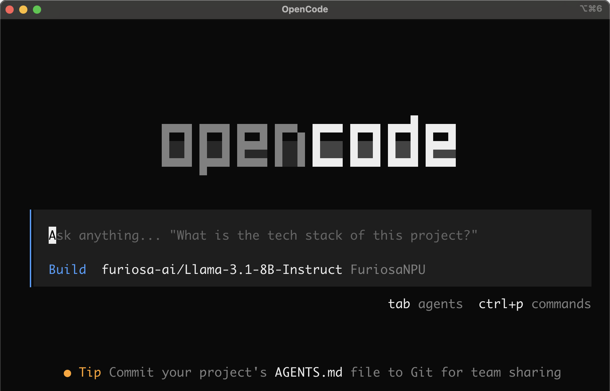

# OpenCode with Furiosa-LLM



[OpenCode](https://opencode.ai) is a 100% open source terminal-based AI coding agent. This project configures OpenCode to use Furiosa-LLM as its backend via the OpenAI-compatible API.

## Installation

Recommended model for this project:

```bash
furiosa-llm serve furiosa-ai/Qwen3-32B-FP8 --enable-auto-tool-choice --tool-call-parser hermes --reasoning-parser qwen3
```

## Usage

```bash
cd opencode
bash opencode.sh
```

The script will:
1. Auto-install OpenCode if not already on `PATH`
2. Write `opencode.json` in the current directory with the Furiosa-LLM provider configuration
3. Verify the LLM server is reachable
4. Launch the `opencode` terminal UI

### Custom Endpoint or Model

Override the defaults via environment variables:

| Variable | Default | Description |
|---|---|---|
| `FURIOSA_BASE_URL` | `http://localhost:8000/v1` | Furiosa-LLM API endpoint |
| `FURIOSA_MODEL` | `furiosa-ai/Qwen3-32B-FP8` | Model ID written into `opencode.json`, which used when launch opencode |

Example:

```bash
FURIOSA_BASE_URL="http://localhost:8001/v1" FURIOSA_MODEL="furiosa-ai/Llama-3.3-70B-Instruct" bash opencode.sh
```

## Project Structure

```
opencode/
├── opencode.sh           # Entry-point shell script
├── furiosa-opencode.py   # Setup and launch logic
└── README.md
```
