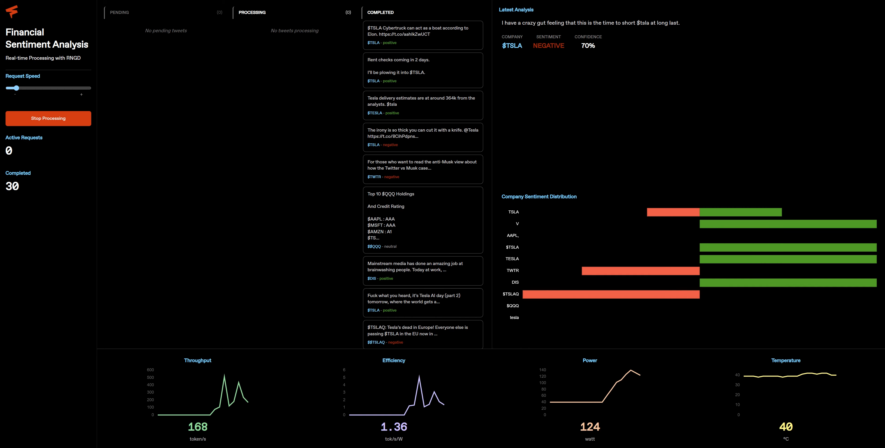

# Financial Sentiment Analysis

This application streams stock-market tweets, classifies each tweet's sentiment (positive, negative, or neutral) using an LLM running on RNGD, and extracts stock ticker symbols (e.g. `$TSLA`, `$NVDA`) in real time.



## Features
- Three-stage pipeline view (Pending, Processing, Completed)
- Per-company sentiment distribution chart
- Real-time system performance metrics: throughput, efficiency, power, temperature
- Configurable request rate using a Poisson arrival model to simulate realistic bursty traffic patterns

## Installation

```bash
furiosa-llm serve furiosa-ai/Llama-3.3-70B-Instruct --enable-auto-tool-choice --tool-call-parser llama3_json
```

```bash
pip install -r backend/requirements.txt
```

## Usage

Start the backend server:

```bash
cd backend
python main.py
```

Open [http://localhost:8001](http://localhost:8001) in your browser. Use the sidebar controls to adjust request speed and click **Start Processing** to begin.

The frontend is prebuilt and served from `backend/static/`. To rebuild the frontend, run `./build.sh`.
