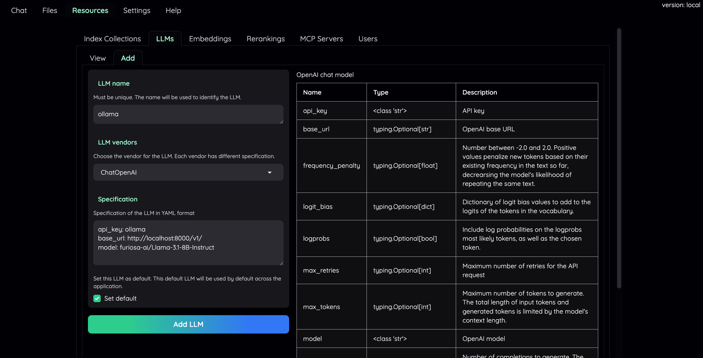
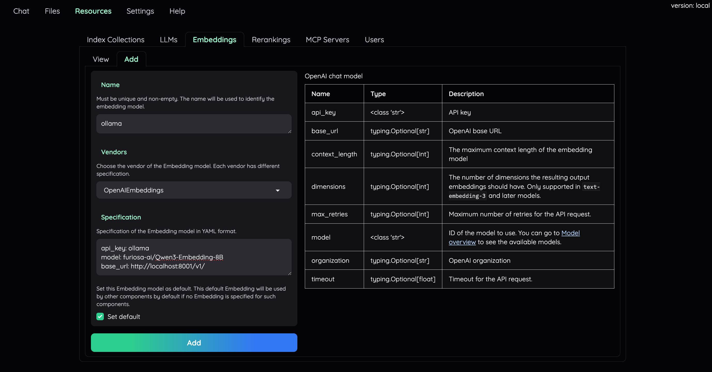
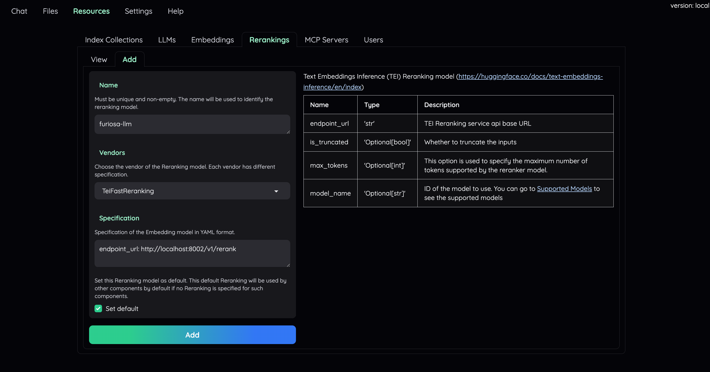

# Kotaemon Integration

Kotaemon is an open-source RAG UI platform designed for both users and developers to build and customize RAG pipelines. This project integrates Furiosa-LLM with Kotaemon to demonstrate how to build an RNGD-accelerated RAG application.


## Features

- End-to-end RAG pipeline using Furiosa-LLM (LLM, embedding, and reranker)
- Hybrid Search (Vector + Text Search)
- Document highlighting and mindmap visualization

## Installation

```bash
# optional (setup env)
conda create -n kotaemon python=3.10
conda activate kotaemon

# clone this repo
git clone https://github.com/furiosa-ai/kotaemon.git -b working_version
cd kotaemon

pip install -e "libs/kotaemon[all]" -e "libs/ktem"
```

## Server configuration
Launch Furiosa-LLM servers, each running LLM, embedding, and reranker models.
```bash
# llm server
furiosa-llm serve furiosa-ai/Llama-3.1-8B-Instruct \
    --enable-prefix-caching \
    --enable-auto-tool-choice \
    --tool-call-parser llama3_json \
    --port 8000 --devices "npu:0"

# embedding server
furiosa-llm serve furiosa-ai/Qwen3-Embedding-8B --devices "npu:1" --port 8001

# reranker server
furiosa-llm serve furiosa-ai/Qwen3-Reranker-8B --devices "npu:2" --port 8002
```

## Usage
- Step 0. Start the application and open WebUI from public URL:
  ```bash
  python app.py
  ```
- Step 1. Select **Advanced Mode**.
- Step 2. Log in with the following credentials:
  ```bash
  user: admin
  password: admin
  ```

- Step 3. Navigate to the **Resources tab**.
- Step 4. Configure LLMs:
    - Set Ollama as the default (View → Ollama → Set as default)
    - Fill in the configuration below and click Save

        | Type | Name | Vendor | API Key | Model | Base URL |
        |-----|-----|-----|-----|-----|-----|
        | LLM | ollama | ChatOpenAI | ollama |  `furiosa-ai/Llama-3.1-8B-Instruct` | http://localhost:8000/v1/ |

<div align="center">
    
</div>

- Step 5. Configure LLMs:
    - Set Ollama as the default (View → Ollama → Set as default)
    - Fill in the configuration below and click Save

        | Type | Name | Vendor | API Key | Model | Base URL |
        |-----|-----|-----|-----|-----|-----|
        | Embedding | ollama | OpenAIEmbeddings | ollama |`furiosa-ai/Qwen3-Embedding-8B` | http://localhost:8001/v1/ |

<div align="center">
    
</div>

- Step 6. Configure Reranking:
    - Add a new configuration using the details below
    - Click Set as default, then Add

        | Type | Name | Vendor | Endpoint URL |
        |-----|-----|-----|-----|
        | Reranker | furiosa-llm | TeiFastReranking | http://localhost:8002/v1/rerank |

<div align="center">
    
</div>


- Step 7. Upload documents or a URL to search on **Quick Upload**.
- Step 8. Start asking questions.
